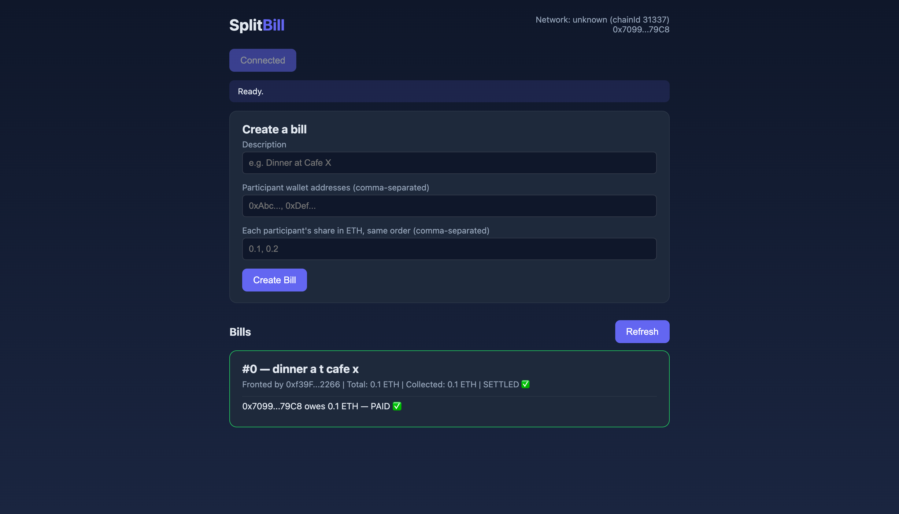
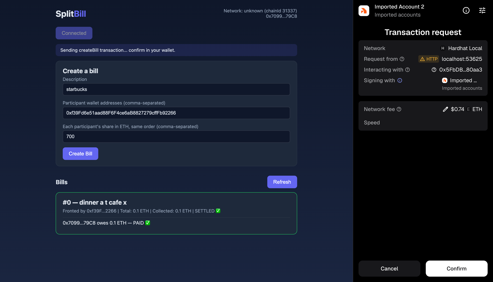
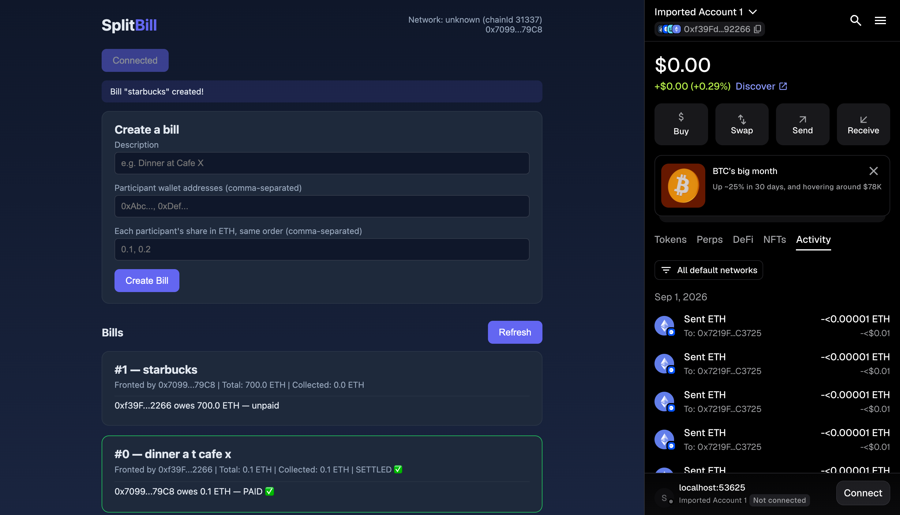
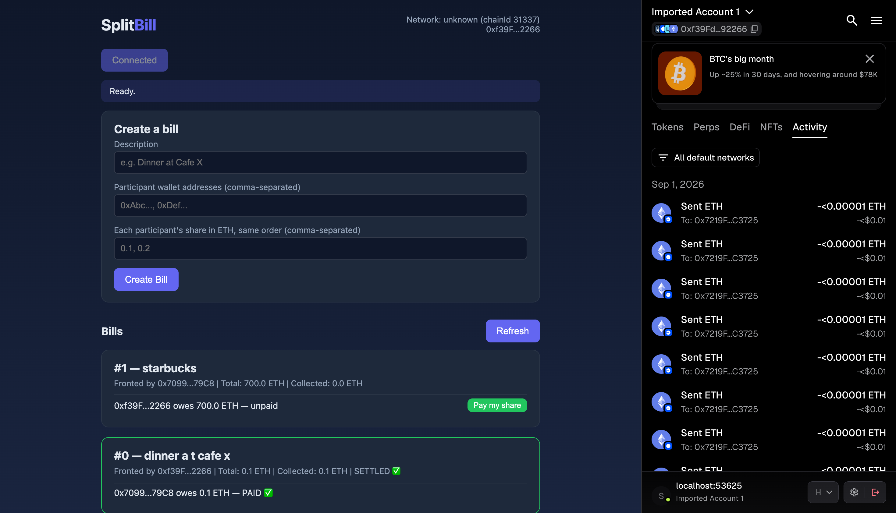
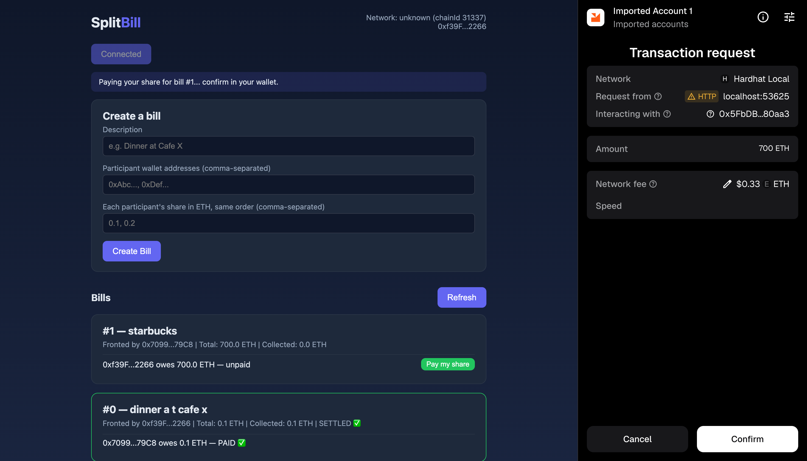
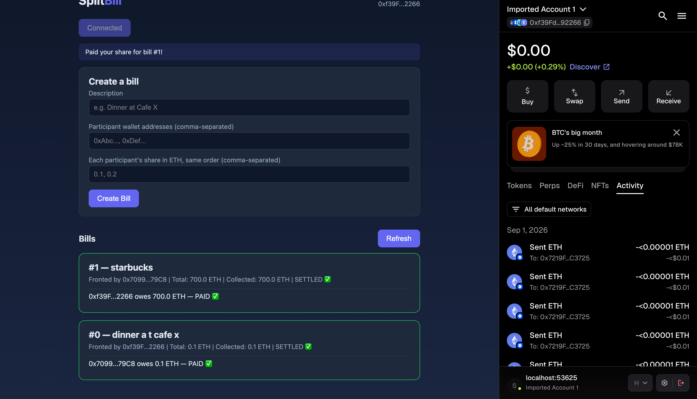

# SplitBill DApp 💸⚡

[](https://soliditylang.org/)
[](https://hardhat.org/)
[](https://docs.ethers.org/v6/)
[](https://hardhat.org/hardhat-runner/docs/guides/test-contracts)
[](LICENSE)

> A trustless, non-custodial group expense splitter on Ethereum. Front a shared bill, split the cost, and settle instantly with on-chain transparency.

---

## 📖 Overview

**SplitBill DApp** eliminates the need for trusted intermediaries, centralized payment apps, or custodial escrows when splitting shared expenses (such as dinners, trips, or rent). 

One person fronts the expense upfront and creates a bill specifying each participant's address and share. Participants pay their exact share directly into the smart contract, which **immediately and atomically forwards the payment to the person who paid upfront**. Funds are never locked in the contract, and every transaction is publicly verifiable on-chain.

---

## ✨ Key Features

- **⚡ Zero Custody / Atomic Settlement**: Funds never sit idle inside the contract. Each payment is forwarded to the fronting payer within the same transaction.
- **🛡️ Built-in Smart Contract Guardrails**:
  - Rejects payments from non-participants.
  - Enforces exact share payment amounts in wei.
  - Prevents duplicate payments for the same bill.
  - Automatically transitions bill status to `SETTLED` once all shares are received.
- **🔍 Full On-Chain Transparency**: Emits granular events (`BillCreated`, `SharePaid`, `BillSettled`) for live updates and auditability.
- **🌐 Minimalist Web3 Frontend**: Lightweight, responsive UI built with Vanilla HTML/CSS and Ethers.js v6—no heavy framework overhead, just direct MetaMask interaction.

---

## 📸 Visual Walkthrough

### 1. Dashboard & Bill Overview
Connect your MetaMask wallet to view your active network, wallet address, and existing bills with real-time settlement badges.



---

### 2. Creating a Group Bill
Enter a bill description, participant wallet addresses, and corresponding ETH shares. Sign the `createBill` transaction directly from MetaMask.

| Transaction Request | Bill Created & Listed |
| :---: | :---: |
|  |  |

---

### 3. Paying Your Share
When connected as a participant, the interface highlights your unpaid balance with an interactive **"Pay my share"** action.

| Participant View | MetaMask Payment Confirmation |
| :---: | :---: |
|  |  |

---

### 4. Automatic Settlement
Once the final participant completes their payment, the smart contract automatically marks the bill as `SETTLED ✅` and emits a `BillSettled` event.



---

## 🏗️ Architecture & Workflow

```mermaid
sequenceDiagram
    autonumber
    actor Payer as Payer (Fronts Expense)
    actor Participant as Participant
    participant Contract as SplitBill Smart Contract
    
    Payer->>Contract: createBill(description, participants, shares)
    Note over Contract: Stores bill details and emits BillCreated
    
    Participant->>Contract: payShare(billId) with exact ETH
    Note over Contract: Validates participant, unpaid status and exact ETH
    Contract-->>Payer: Atomically forwards ETH to payer
    Contract-->>Participant: Emits SharePaid(billId, participant, amount)
    
    alt All participants have paid
        Note over Contract: bill.settled = true
        Contract-->>Payer: Emits BillSettled(billId, totalAmount)
    end
```

### Smart Contract Methods (`SplitBill.sol`)

- `createBill(string description, address[] participants, uint256[] shares)`: Creates a new bill record with assigned shares. The transaction sender becomes the `payer` eligible for reimbursement.
- `payShare(uint256 billId)`: Payable method that verifies caller eligibility and exact share amount, marks the caller as paid, forwards funds to the `payer`, and settles the bill if fully funded.
- `getBillDetails(uint256 billId)`: Single batched view function providing the frontend with all bill data (payer, description, totals, participant list, share amounts, paid flags).
- `getParticipants(uint256 billId)`: Returns the array of participant addresses for a given bill.

---

## 🗂️ Project Structure

```
splitbill-dapp/
├── contracts/
│   └── SplitBill.sol            # Core smart contract
├── test/
│   └── SplitBill.test.js        # Comprehensive unit tests (9 test specs)
├── scripts/
│   ├── deploy.js                # Hardhat deployment script
│   └── compile-with-solc.js     # Fallback standalone solc compiler
├── frontend/
│   ├── index.html               # Main DApp interface
│   ├── app.js                   # Web3 wallet connection & contract interactions
│   └── abi.js                   # Contract Application Binary Interface (ABI)
├── screenshots/                 # Application screenshots & UI demo assets
├── hardhat.config.js            # Hardhat environment & network configuration
├── package.json                 # Project scripts and dependencies
└── .env.example                 # Template for testnet environment variables
```

---

## 🚀 Quickstart Guide

### Prerequisites

- [Node.js](https://nodejs.org/) (v18+)
- [MetaMask](https://metamask.io/) browser extension

### 1. Installation

Clone the repository and install dependencies:

```bash
git clone https://github.com/Shubh-153/splitbill-dapp.git
cd splitbill-dapp
npm install
```

### 2. Compile & Test

Compile the smart contract and run the automated test suite:

```bash
npm run compile
npm test
```

**Test Suite Coverage (9/9 passing):**
- ✔ Creates a bill with correct total and details
- ✔ Rejects mismatched participants and shares arrays
- ✔ Rejects payer trying to also be a participant
- ✔ Lets a participant pay their exact share and forwards it to the payer
- ✔ Rejects paying incorrect amounts
- ✔ Rejects non-participants trying to pay
- ✔ Rejects duplicate payments
- ✔ Marks bill settled once all participants pay
- ✔ Rejects payments on non-existent bills

---

## 💻 Running Locally

### Step 1: Start a Local Node
Spin up a local Ethereum node with 20 pre-funded test accounts:

```bash
npx hardhat node
```

### Step 2: Deploy Contract
In a separate terminal, deploy `SplitBill` to the local network:

```bash
npm run deploy:localhost
```

Copy the deployed contract address printed in the console and update `CONTRACT_ADDRESS` in `frontend/app.js`:

```javascript
const CONTRACT_ADDRESS = "0xYourDeployedContractAddressHere";
```

### Step 3: Configure MetaMask
1. Add a custom network in MetaMask:
   - **Network Name**: `Hardhat Local`
   - **RPC URL**: `http://127.0.0.1:8545`
   - **Chain ID**: `31337`
   - **Currency Symbol**: `ETH`
2. Import 2 or more private keys output by `npx hardhat node` into MetaMask to simulate multiple accounts.

### Step 4: Serve the Frontend
Serve the frontend using any static HTTP server:

```bash
npx serve frontend
```

Open the printed `localhost` URL in your browser, connect your MetaMask wallet, and start splitting expenses!

---

## 🌐 Deploying to Sepolia Testnet

1. Obtain a Sepolia RPC endpoint from [Alchemy](https://www.alchemy.com/) or [Infura](https://infura.io/).
2. Fund a test wallet with Sepolia ETH using a public faucet (e.g., [sepoliafaucet.com](https://sepoliafaucet.com)).
3. Configure your environment variables:
   ```bash
   cp .env.example .env
   ```
   Add your RPC URL and private key:
   ```env
   SEPOLIA_RPC_URL="https://eth-sepolia.g.alchemy.com/v2/YOUR_API_KEY"
   PRIVATE_KEY="your_wallet_private_key"
   ```
4. Deploy to Sepolia:
   ```bash
   npm run deploy:sepolia
   ```
5. Update `CONTRACT_ADDRESS` in `frontend/app.js` with your Sepolia deployment address, switch your MetaMask network to **Sepolia**, and launch the frontend.

---

## 🛠️ Tech Stack

- **Smart Contract**: Solidity (`^0.8.24`)
- **Ethereum Development**: Hardhat, Ethers.js
- **Testing & Assertions**: Mocha, Chai, Hardhat Network Helpers
- **Frontend**: HTML5, Modern CSS3 (Dark Mode Theme), Vanilla JavaScript (ES6+)
- **Wallet Provider**: MetaMask / EIP-1193 Standard

---

## 📄 License

This project is licensed under the [MIT License](LICENSE).
